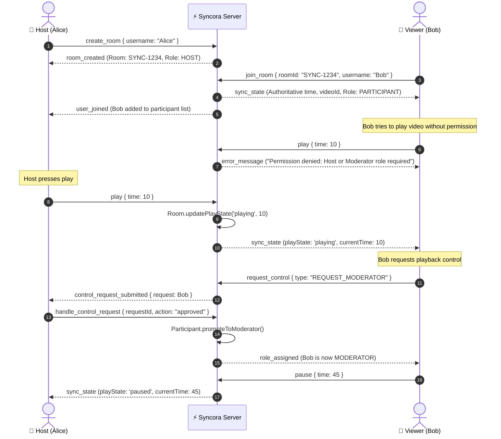

# ✨ Syncora — Every moment, in sync.

[](https://www.typescriptlang.org/)
[](https://reactjs.org/)
[](https://socket.io/)
[](https://tailwindcss.com/)
[](https://nodejs.org/)

> **Syncora** is a real-time, collaborative YouTube watch party platform. It brings people together across the globe to watch videos with sub-second synchronization, strict server-side Role-Based Access Control (RBAC), participant approval workflows, live chat, and animated reactions.

---

## 🚀 Live Demo & Repository
- **Live Deployment URL**: `https://syncora-watchparty.onrender.com` *(Replace with your live deployment link or Render/Railway URL)*
- **GitHub Repository**: `https://github.com/your-username/syncora`

---

## 🎨 Visual Identity & Brand Guidelines
- **Product Name**: **Syncora** (*Sync + Aura*)
- **Tagline**: *"Every moment, in sync."*
- **Brand Palette**:
  - **Electric Violet** (`#8067F5`): Primary interactive accent & brand radiance.
  - **Midnight Navy** (`#0B1020`): Deep, distraction-free cinematic background.
  - **Lavender Glow** (`#A99BFF`): Secondary highlights, badge accents, and focus indicators.
  - **Cloud White** (`#FFFFFF`): High-contrast readable typography.
- **Design Philosophy**: Minimalist dark-mode theater aesthetic with glassmorphic cards, glowing borders, and clean Inter typography.

---

## 🌟 Core Features & Capabilities

### 1. 🔄 Sub-Second Real-Time Synchronization
- **Server-Authoritative Clock**: Rather than trusting clients or spamming sync pings, the backend maintains the authoritative video ID, playback state (`playing`, `paused`, `buffering`), position in seconds, and `lastUpdatedAt` timestamp.
- **Elapsed Time Interpolation**: When a video is playing, server computes exact current time mathematically:
  $$\text{Authoritative Time} = \text{currentTime} + \frac{\text{Date.now()} - \text{lastUpdatedAt}}{1000} \times \text{playbackRate}$$
- **Anti-Echo Feedback Loop Protection**: Programmatic flags prevent clients from re-broadcasting events when applying server updates.
- **Smart Drift Correction**: If a client drifts $> 1.75\text{s}$ behind or ahead (due to network lag or buffer stall), it smoothly seeks to the authoritative time.
- **Visual "In Sync" Status**: Real-time badge indicates connection health, latency, and drift.

### 2. 🛡️ Role-Based Access Control (RBAC)
Rooms support three hierarchical roles with backend-enforced permissions:

| Role | Who Assigns | Permissions |
| :--- | :--- | :--- |
| **👑 Host** | Auto (Room Creator) or Transferred | Full control: play, pause, seek, change video, assign/revoke roles, remove participants, transfer host, approve/reject control requests. |
| **🛡️ Moderator** | Host (or approved by Host) | Play, pause, seek, change video; review participant control requests. |
| **👤 Viewer / Participant** | Default for all joiners | Watch-only mode; playback controls locked to prevent trolls from hijacking the room. |

> **Backend Role Enforcement**: Every sensitive socket event (`play`, `pause`, `seek`, `change_video`, `assign_role`, `remove_participant`, `transfer_host`) validates permissions on the server before execution. Client-side role claims are never trusted.

### 3. 🙋 Participant Control Request System
- Viewers can click **"Request Control"** or attempt an action to submit an approval request.
- The Host and Moderators receive real-time notifications with a pending request badge.
- Host can approve (promoting the participant to Moderator or executing the requested video change) or decline the request with one click.

### 4. 🔗 Seamless Room Creation & 1-Click Invites
- Instant room generation with clean 6-character room codes (e.g., `SYNC-4A9B`).
- Shareable invitation links (e.g., `https://syncora.app/?room=SYNC-4A9B`).
- Direct join from homepage by typing the code or pasting an invite URL.

### 5. 💬 Social & Collaborative Enhancements
- **Live Room Chat**: Integrated text chat with system event announcements (*user joined*, *video changed*, *role updated*).
- **Floating Emoji Reactions**: Interactive reaction buttons (❤️, 🔥, 😂, 👏, 🍿, 🚀, 🎉) that float smoothly over the video screen in real time.
- **Curated Video Library**: Preset catalog (Lofi Girl, Big Buck Bunny 4K, Nature 4K, Cyberpunk reels) for testing with zero setup.

---

## 🏗️ System Architecture & Object-Oriented Design (OOP)

The WebSocket backend is engineered using **Object-Oriented Design (OOP)** principles:

```
server/src/
├── models/
│   ├── Room.ts               # Encapsulates room state, playback metadata, participants map, chat history
│   └── Participant.ts        # Encapsulates connection identity, role, avatar, and permission helpers
├── services/
│   ├── RoomManager.ts        # Singleton managing active rooms registry and socket lifecycle
│   ├── PermissionService.ts  # Role authorization validator enforcing RBAC rules
│   └── SyncService.ts        # Drift detection algorithms and authoritative state generation
├── sockets/
│   ├── events.ts             # Strongly typed Socket.IO event constants
│   └── socketHandler.ts      # Binds events, validates payloads, and delegates to domain models
└── server.ts                 # Express HTTP server + Socket.IO server + Production SPA host
```

### WebSocket Event Protocol



---

## 🛠️ Tech Stack & Decisions

| Layer | Technology | Rationale |
| :--- | :--- | :--- |
| **Frontend** | React 18, TypeScript, Vite | Fast development, strong type safety, optimized production bundling. |
| **Styling** | Tailwind CSS, Lucide Icons | Utility-first responsive design, custom midnight theme, accessible icon set. |
| **Backend** | Node.js, Express, TypeScript | Lightweight, high-throughput asynchronous event handling. |
| **Real-Time** | WebSockets (Socket.IO) | Bidirectional WebSocket engine with automatic fallbacks and heartbeat ping/pong. |
| **Database** | SQLite (`better-sqlite3` with WAL mode) | High-performance ACID storage for persistent room states, members, and chat history. |
| **Video Engine** | YouTube IFrame Player API | Direct programmatic iframe control with custom synchronized controls. |

---

## ⚡ Getting Started (Local Development)

### Prerequisites
- Node.js `v18+` or `v20+` (tested on Node `v24.13.1`)
- npm `v9+`

### 1. Clone the repository
```bash
git clone https://github.com/your-username/syncora.git
cd syncora
```

### 2. Install dependencies
```bash
# Install root, server, and client dependencies
npm run install:all
```

### 3. Run development servers concurrently
```bash
npm run dev
```
- **Frontend App**: `http://localhost:5173`
- **Backend WebSocket Server**: `http://localhost:4000`
- *(Vite dev server automatically proxies `/socket.io` and `/api` to port 4000)*

---

## 🧪 Automated Verification Test Suite

Syncora includes an automated multi-client test suite that starts an in-memory WebSocket server and validates:
1. Room creation and Host role assignment
2. Participant joining and state synchronization
3. **Backend RBAC enforcement** (unauthorized viewer commands are rejected)
4. Authorized play/pause/seek/change-video synchronization
5. Control request submission & Host approval workflow
6. Moderator permission promotion & execution
7. Real-time chat & floating emoji reactions
8. Participant removal & cleanup

To run the test suite:
```bash
npm test
```

Expected output:
```
🧪 Starting Syncora Real-Time Engine & RBAC Verification Tests...
✅ Test server started on http://localhost:4009

▶ Test 1: Host Room Creation...
  ✓ Alice created room as HOST
▶ Test 2: Participant Joining...
  ✓ Bob joined room as PARTICIPANT
▶ Test 3: Unauthorized Play Command Rejection...
  ✓ Bob's unauthorized play command was correctly rejected by backend
▶ Test 4: Authorized Playback Synchronization...
  ✓ Bob received synchronized play state
▶ Test 5: Change Video Synchronization...
  ✓ Bob received new video synchronization
▶ Test 6: Participant Control Request & Host Approval...
  ✓ Request approved! Bob is now promoted to MODERATOR
▶ Test 7: Newly Promoted Moderator Playback Control...
  ✓ Bob successfully paused video as MODERATOR
▶ Test 8: Live Room Chat & Emoji Reactions...
  ✓ Real-time messages & reactions received
▶ Test 9: Host Remove Participant...
  ✓ Bob was notified of removal by Host

🎉 ALL 9 REAL-TIME ENGINE & RBAC TESTS PASSED SUCCESSFULLY! 🚀
```

---

## 🌐 Production Deployment Guide

Syncora is built so that the production Node.js server serves both the **WebSocket engine** and the **compiled static React SPA** on a single port. This avoids CORS complexities and makes deploying to platforms like **Render**, **Railway**, or **Fly.io** simple.

### Option 1: Deploy to Render (Recommended)
1. Fork or push this repository to GitHub.
2. In Render, select **New +** -> **Web Service**.
3. Connect your GitHub repository.
4. Configure service settings:
   - **Environment**: `Node`
   - **Build Command**: `npm run build`
   - **Start Command**: `npm run start`
   - **Plan**: Free or Starter
5. Add Environment Variables:
   - `NODE_ENV`: `production`
   - `PORT`: `10000` (Render sets `PORT` automatically)
6. Click **Deploy**. Your app will be live at `https://<your-service-name>.onrender.com`.

### Option 2: Deploy to Railway
1. Click **New Project** -> **Deploy from GitHub repo**.
2. Railway detects the `package.json` scripts:
   - Build: `npm run build`
   - Start: `npm run start`
3. Generate domain in Railway settings.

### Option 3: Separate Frontend (Vercel / Netlify) + Backend (Render / Railway)
- **Backend**: Deploy `server/` with `npm run start`.
- **Frontend**: Deploy `client/` to Vercel/Netlify.
  - Set Environment Variable in Vercel/Netlify: `VITE_SERVER_URL=https://your-backend.onrender.com`

---

## 📈 Scalability & High-Availability Roadmap

For horizontal scaling to **1,000+ users, 100+ rooms, 50+ users per room**:
1. **Socket.IO Redis Adapter**:
   - Replace in-memory state with `@socket.io/redis-adapter` and Redis Pub/Sub so multiple Node.js instances can broadcast across rooms.
2. **Persistent Room Storage**:
   - Store room records in PostgreSQL or Redis with TTL (e.g. expire inactive rooms after 2 hours).
3. **Sticky Sessions & Load Balancing**:
   - Configure NGINX or AWS ALB with sticky sessions (cookie-based or IP hash) for WebSocket transport stability.
4. **WebRTC Mesh for Audio/Video**:
   - For future voice watch-party rooms, incorporate WebRTC mesh or SFU (LiveKit / mediasoup).

---

## 💡 Code Walkthrough & Technical Trade-Offs

1. **Why Custom Controls instead of native YouTube controls?**
   - Native iframe controls allow participants to click pause directly within YouTube without notifying the server, causing instant desync. Custom synchronized controls ensure playback actions are intercepted, authenticated by the server, and synchronized to all peers.
2. **How is Autoplay Handled?**
   - Modern browsers prohibit unmuted media playback without user interaction. Syncora detects if the browser suspended playback and renders a sleek, non-intrusive "Click to Unmute" button so audio begins cleanly upon user click.
3. **Drift Detection vs. Rigid Seeking:**
   - Minor network jitter of 100-300ms is normal. Seeking on tiny variations would cause stutter. Syncora uses a $1.75\text{s}$ tolerance window: anything under $1.75\text{s}$ continues smoothly; anything greater triggers a correction seek.

---

## 📄 License
This project is open-source and available under the [MIT License](LICENSE).
