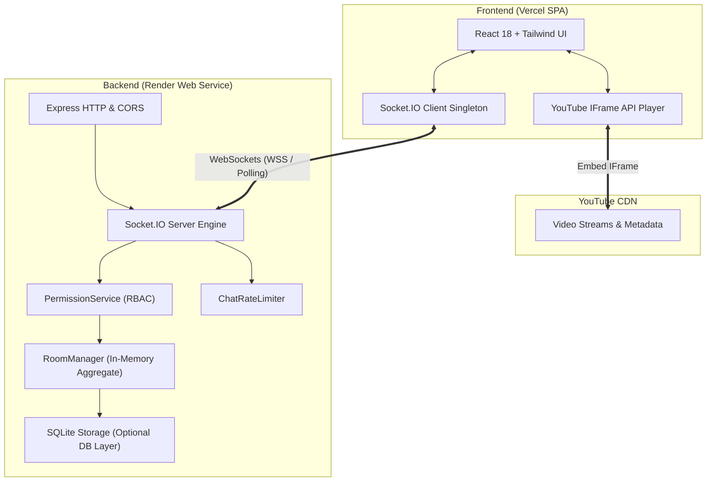

# ✨ Syncora — Real-Time YouTube Watch Party

[](https://www.typescriptlang.org/)
[](https://reactjs.org/)
[](https://vitejs.dev/)
[](https://socket.io/)
[](https://tailwindcss.com/)
[](https://nodejs.org/)

> **Syncora** is a real-time, collaborative YouTube watch party web application built with React, TypeScript, Vite, Node.js, Express, and Socket.IO. Designed around an intimate digital screening room aesthetic, Syncora delivers sub-second video synchronization, server-authoritative Role-Based Access Control (RBAC), host approval workflows for participant playback requests, and a moderated real-time chat with anti-spam protection.

---

## 🌐 Live URLs & Deployment Status

| Service | Platform | Status | URL |
| :--- | :--- | :--- | :--- |
| **Frontend Client** | Vercel | 🟢 **Live in Production** | [https://syncora-kappa.vercel.app](https://syncora-kappa.vercel.app) <br> [https://syncora-4vvqyofl1-aryanpatel-ais-projects.vercel.app](https://syncora-4vvqyofl1-aryanpatel-ais-projects.vercel.app) |
| **Backend API & WebSockets** | Render | 🟢 **Live in Production** | [https://syncora-backend-rfs0.onrender.com](https://syncora-backend-rfs0.onrender.com) |

> [!NOTE]
> The codebase is fully configured with production environment variable adapters, SPA route rewrite rules (`vercel.json`), Render Web Service manifests (`render.yaml`), and strict CORS handlers.
> See the dedicated [Deployment Guide (docs/DEPLOYMENT.md)](docs/DEPLOYMENT.md) and [Step-by-Step Production Deployment Guide](#-step-by-step-production-deployment-guide) below to deploy in minutes.

---

## 🎨 Visual Direction & Screening Room Aesthetic

Syncora avoids generic dashboard templates in favor of a bespoke **intimate digital screening room**:
- **Main Canvas**: Ink black (`#101114`) providing maximum contrast and a distraction-free cinematic backdrop.
- **Surface Elevation**: Deep obsidian (`#16181D` and `#1C1E24`) with subtle borders (`#282A33`).
- **Primary Typography**: Warm off-white (`#F2F0E9`) for effortless readability.
- **Accent Radiance**: Vivid lime (`#D6F279`) paired with subtle electric glow effects for primary actions, active indicators, and playback scrubber highlights.
- **Secondary Accents**: Cool graphite (`#8E919C`) and status colors (amber `#E5A84B` for buffering/requests, rose `#F87171` for destructive actions).
- **Motion & Accessibility**: Fluid CSS transitions respecting `prefers-reduced-motion`, visible focus indicators (`:focus-visible`), and ARIA landmarks.

---

## 🌟 Core Features

### 1. 🔄 Sub-Second Real-Time Synchronization
- **Server-Authoritative Clock**: The server tracks authoritative video ID, playback state (`playing`, `paused`, `buffering`), position in seconds, and timestamps.
- **Elapsed Time Interpolation**: When a video is playing, the server computes exact playback position mathematically without flooding the network:
  $$\text{Current Position} = \text{currentTime} + \frac{\text{Date.now()} - \text{lastUpdatedAt}}{1000} \times \text{playbackRate}$$
- **Anti-Echo Feedback Loop Protection**: Programmatic state guards prevent player event listeners from echoing updates back to the server when applying incoming socket changes.
- **Smart Drift Correction**: If a client drifts $> 1.75\text{s}$ behind or ahead (due to network latency or browser tab suspension), it smoothly auto-corrects.
- **Live Sync Badge**: Header status indicator displays real-time connection state (`In Sync`, `Syncing`, `Disconnected`).

### 2. 🛡️ Authoritative Role-Based Access Control (RBAC)
Server-side RBAC enforces permissions on every single sensitive action:

| Role | Hierarchy | Assigned By | Capabilities |
| :--- | :---: | :--- | :--- |
| **👑 Host** | Level 3 | Room Creator or Transferred | • Full playback control (Play, Pause, Seek, Change Video)<br>• Promote / Demote participants to Moderator<br>• Remove / Kick participants from the room<br>• Approve or reject participant playback requests<br>• Transfer Host ownership |
| **🛡️ Moderator** | Level 2 | Host (or via approved request) | • Full playback control (Play, Pause, Seek, Change Video)<br>• Review and approve / reject playback requests<br>• Cannot demote, kick, or change participant roles |
| **👤 Participant** | Level 1 | Default upon joining | • Watch synchronized video<br>• View live participant roster<br>• Submit playback control requests for approval<br>• Cannot directly alter playback or video |

> **Strict Server Validation**: Client UI disables locked buttons for usability, but authorization is 100% verified on the backend. Any unauthorized socket packet is immediately rejected with an `error_message`.

### 3. 🙋 Playback Control Request & Approval Workflow
- When a Participant attempts to play, pause, seek, or change a video, they are prompted to submit an approval request.
- Host and Moderators receive real-time notifications with a pending request badge.
- Reviewers can approve or reject requests with one click. Approvals automatically execute the requested action across the entire room.

### 4. 💬 Real-Time Moderated Chat
- **Server-Authoritative Identity**: Sender username and role are resolved from active room records, preventing spoofing.
- **Safety Guards**: Strips whitespace, rejects empty messages, and enforces a strict 500-character limit.
- **Anti-Spam Rate Limiter**: Server-side sliding-window rate limiter prevents flooding while allowing natural conversation.
- **System Announcements**: Automated room notifications for user join, user leave, video change, and role promotions.

### 5. ❤️ Live Audience Presence & Like Reactions System
- **Real-Time Audience Presence**: Header displays `Watching now · <count>` with an overlapping avatar cluster, live green connection dots, and role badges.
- **Audience Roster Popover**: Accessible dropdown dialog listing all active members and their current roles, with an empty state featuring a 1-click invite copy button.
- **Synchronized Like Counter**: Clickable Like button in the playback controls broadcasts live to all watching clients with a synchronized room `likeCount`.
- **Floating Heart Animations**: Floating reaction overlay over the cinema player with smooth float-up animations respecting `prefers-reduced-motion`.
- **Anti-Spam Cooldown**: Server-enforced 500ms per-client cooldown prevents rapid reaction flooding while isolating room totals across screening rooms.

### 6. 🔗 1-Click Invites & Instant Rooms
- Unique 6-character room codes (e.g., `SYNC-4A9B`).
- Shareable invitation links (e.g., `https://syncora.vercel.app/room/SYNC-4A9B`).
- Automatic pre-fill of room codes when opening invite URLs.

---

## 🏗️ Architecture & Real-Time Flow

### System Architecture Diagram



### Real-Time Playback & Approval Sequence

```mermaid
sequenceDiagram
    autonumber
    actor Host as 👑 Host (Alice)
    participant Server as ⚡ Syncora Server
    actor Participant as 👤 Participant (Bob)

    Host->>Server: create_room { username: "Alice" }
    Server-->>Host: room_snapshot (Room ID, Role: HOST)

    Participant->>Server: join_room { roomId: "BFYCFK", username: "Bob" }
    Server-->>Participant: room_snapshot (Current Video, Playback Time, Role: PARTICIPANT)
    Server-->>Host: user_joined { username: "Bob", role: "participant" }

    Note over Participant: Bob attempts to pause video directly
    Participant->>Server: pause { currentTime: 42 }
    Server-->>Participant: error_message ("Permission denied: Only Host or Moderator can pause video.")

    Note over Participant: Bob submits a playback change request
    Participant->>Server: request_playback_change { actionType: "change_video", requestedVideoId: "M7lc1UVf-VE" }
    Server-->>Host: control_request_submitted { request: Bob (change_video) }

    Note over Host: Host reviews and approves request
    Host->>Server: approve_request { requestId: "req_123" }
    Server->>Server: Room.setVideo("M7lc1UVf-VE")
    Server-->>Host: sync_state { videoId: "M7lc1UVf-VE", playState: "playing", currentTime: 0 }
    Server-->>Participant: sync_state { videoId: "M7lc1UVf-VE", playState: "playing", currentTime: 0 }
    Server-->>Participant: control_request_updated { requestId: "req_123", status: "approved" }
```

---

## 📁 Repository Structure

```
watchparty/
├── client/                     # Frontend Application (React + Vite + TypeScript)
│   ├── public/                 # Static assets & icons
│   ├── src/
│   │   ├── components/         # Modular UI Components
│   │   │   ├── chat/           # Real-time chat & reactions
│   │   │   ├── controls/       # Synchronized playback controls
│   │   │   ├── layout/         # Screening room headers & navigation
│   │   │   ├── modals/         # Request approval & share modals
│   │   │   ├── participants/   # Participant roster & role management
│   │   │   ├── player/         # YouTube IFrame player with anti-echo logic
│   │   │   └── ui/             # Badges, buttons, and design tokens
│   │   ├── context/            # WatchPartyContext (Single source of truth)
│   │   ├── lib/                # Socket.IO client singleton & event definitions
│   │   ├── pages/              # Home and Watch Room views
│   │   └── App.tsx             # Route parsing & top-level layout
│   ├── .env.example            # Frontend environment variable template
│   ├── vercel.json             # Vercel SPA route rewrite rules
│   └── package.json            # Client dependencies and build scripts
│
├── server/                     # Backend Application (Node.js + Express + Socket.IO)
│   ├── src/
│   │   ├── config/             # Constants, default videos, server configurations
│   │   ├── database/           # SQLite connection & schema initialization
│   │   ├── models/             # Domain aggregates (Room, Participant)
│   │   ├── routes/             # REST API endpoints & room info routes
│   │   ├── services/           # RoomManager, PermissionService, ChatRateLimiter
│   │   ├── sockets/            # Socket.IO connection & event handlers
│   │   ├── test-sync.ts        # Comprehensive 12-test automated integration suite
│   │   └── server.ts           # Express HTTP + Socket.IO server entrypoint
│   ├── .env.example            # Backend environment variable template
│   └── package.json            # Server dependencies and scripts
│
├── render.yaml                 # Render Infrastructure-as-Code Blueprint
├── vercel.json                 # Root Vercel SPA configuration
├── package.json                # Root orchestrator scripts (concurrent dev, build)
└── README.md                   # Full documentation
```

---

## ⚡ Socket.IO Event Contract & Payloads

### Client to Server Events

| Event Name | Payload | Authorization | Description |
| :--- | :--- | :---: | :--- |
| `create_room` | `{ username: string }` | Public | Creates a new room; client becomes Host. |
| `join_room` | `{ roomId: string, username: string }` | Public | Joins an existing room as Participant. |
| `leave_room` | *None* | Member | Leaves the current room gracefully. |
| `play` | `{ currentTime: number }` | Host / Mod | Resumes video playback for all participants. |
| `pause` | `{ currentTime: number }` | Host / Mod | Pauses playback for all participants. |
| `seek` | `{ currentTime: number }` | Host / Mod | Seeks to a specific timestamp across the room. |
| `change_video` | `{ videoId: string }` | Host / Mod | Changes the active YouTube video. |
| `assign_role` | `{ targetUserId: string, newRole: "moderator" \| "participant" }` | Host Only | Updates role of a participant. |
| `remove_participant`| `{ targetUserId: string }` | Host Only | Kicks a participant from the room. |
| `request_playback_change` | `{ actionType: string, requestedTime?: number, requestedVideoId?: string }` | Participant | Submits a playback request for review. |
| `approve_request` | `{ requestId: string }` | Host / Mod | Approves and executes a pending request. |
| `reject_request` | `{ requestId: string }` | Host / Mod | Declines a pending playback request. |
| `send_chat` | `{ message: string }` | Member | Sends a room chat message (rate-limited). |
| `send_reaction` | `{ emoji: string }` | Member | Broadcasts a floating emoji reaction. |
| `sync_ping` | `{ clientTimestamp: number }` | Member | Heartbeat ping to measure latency and drift. |

### Server to Client Events

| Event Name | Payload | Recipient | Description |
| :--- | :--- | :--- | :--- |
| `room_snapshot` | `{ room: RoomSnapshot, user: UserSnapshot }` | Caller | Complete room state delivered upon joining. |
| `participants_updated` | `{ participants: Participant[] }` | Room Broadcast | Full participant list with updated roles. |
| `sync_state` | `{ videoId, playState, currentTime, lastUpdatedAt, updatedBy }` | Room Broadcast | Authoritative playback synchronization state. |
| `user_joined` | `{ user: Participant, message: string }` | Room Broadcast | Broadcast when a new participant enters. |
| `user_left` | `{ userId, username, message: string }` | Room Broadcast | Broadcast when a participant exits or disconnects. |
| `role_assigned` | `{ targetUserId, newRole, updatedBy }` | Room Broadcast | Broadcast when a participant's role changes. |
| `participant_removed` | `{ targetUserId, message: string }` | Room Broadcast | Notifies room and target user of removal. |
| `control_request_submitted` | `{ request: PlaybackRequest }` | Host & Mods | Notifies reviewers of a new pending request. |
| `control_request_updated` | `{ requestId, status, reviewerName }` | Room Broadcast | Notifies room of request approval/rejection. |
| `chat_message` | `{ id, userId, username, role, text, timestamp }` | Room Broadcast | New chat message from a room member. |
| `reaction_received`| `{ id, emoji, senderName }` | Room Broadcast | Broadcast floating reaction animation. |
| `error_message` | `{ message: string }` | Caller | Operation failure or permission denial notice. |
| `room_error` | `{ message: string }` | Caller | Fatal room error (e.g. invalid room code). |

---

## 💻 Local Development Setup

### Prerequisites
- **Node.js**: Version `18.0.0` or higher (tested on Node `v20+` and `v24+`)
- **npm**: Version `9.0.0` or higher

### 1. Clone & Install Dependencies
```bash
git clone https://github.com/your-username/watchparty.git
cd watchparty

# Install root orchestrator, backend, and frontend dependencies in one command
npm run install:all
```

### 2. Configure Environment Variables

**Backend (`server/.env`):**
```bash
cp server/.env.example server/.env
```
Default values in `server/.env`:
```env
PORT=4000
NODE_ENV=development
FRONTEND_URL=http://localhost:5173
CLIENT_URL=http://localhost:5173
```

**Frontend (`client/.env`):**
```bash
cp client/.env.example client/.env
```
Default values in `client/.env`:
```env
VITE_API_URL=http://localhost:4000
VITE_SOCKET_URL=http://localhost:4000
VITE_SERVER_URL=http://localhost:4000
```

### 3. Start Development Servers Concurrently
```bash
npm run dev
```
- **Frontend App**: `http://localhost:5173`
- **Backend Server & WebSockets**: `http://localhost:4000`
- **Health Check Endpoint**: `http://localhost:4000/health`

---

## 🧪 Automated Testing

Syncora includes an automated multi-client integration test suite (`server/src/test-sync.ts`) validating all assignment criteria against an actual running Socket.IO server:

```bash
# Run backend integration tests
npm test
```

### Test Suite Coverage (13/13 Passing)
1. ✅ **Room Creation**: Host role assignment and unique room code generation.
2. ✅ **Participant Joining**: Join flow and automatic state synchronization.
3. ✅ **Validation**: Rejection of empty usernames, non-existent rooms, and invalid YouTube video IDs.
4. ✅ **Broadcasts**: Multi-client notification of joins and departures.
5. ✅ **Playback Sync**: Sub-second synchronization of play, pause, seek, and video changes.
6. ✅ **RBAC Enforcement**: Rejection of unauthorized participant play/pause/seek commands.
7. ✅ **Moderator Capabilities**: Authorized playback control by promoted moderators.
8. ✅ **Administrative Control**: Host-only role management and participant kicking.
9. ✅ **Approval Workflow**: Submission, approval, and rejection of playback change requests.
10. ✅ **Self-Approval Protection**: Preventing participants from approving their own actions.
11. ✅ **Cleanup & Succession**: Automatic host promotion on disconnect and deletion of empty rooms.
12. ✅ **Moderated Chat**: 500-char length limits, empty message trimming, server identity validation, and anti-spam rate limiting.
13. ✅ **Audience Presence & Likes**: Real-time presence broadcasts, synchronized room like counters, 500ms anti-spam cooldown, non-member rejection, and strict room isolation.

---

## 🚀 Step-by-Step Production Deployment Guide

Deploying Syncora involves hosting the Express + Socket.IO backend on **Render** (free Web Service) and the React SPA on **Vercel** (free Hobby tier).

### Step 1: Deploy Backend to Render

1. Log in to your [Render Dashboard](https://dashboard.render.com/) and click **New +** -> **Web Service**.
2. Connect your GitHub repository.
3. Configure the service:
   - **Name**: `syncora-backend`
   - **Root Directory**: `server`
   - **Environment**: `Node`
   - **Build Command**: `npm install && npm run build`
   - **Start Command**: `npm start`
   - **Health Check Path**: `/health`
4. Add the following **Environment Variables**:
   | Key | Value | Notes |
   | :--- | :--- | :--- |
   | `NODE_ENV` | `production` | Enables strict CORS and production optimizations |
   | `FRONTEND_URL` | `https://<your-vercel-app>.vercel.app` | Your frontend Vercel URL (can be updated after Step 2) |
   | `PORT` | `10000` | Render injects `PORT` automatically; our server reads `process.env.PORT` |
5. Click **Create Web Service**.
6. Once deployed, copy your Render service URL (e.g., `https://syncora-backend.onrender.com`).

---

### Step 2: Deploy Frontend to Vercel

> [!IMPORTANT]
> Vite embeds `import.meta.env.VITE_*` variables into the JavaScript bundle **at build time**. You must set the environment variables in Vercel before triggering the build.

1. Log in to your [Vercel Dashboard](https://vercel.com/) and click **Add New...** -> **Project**.
2. Import your GitHub repository.
3. Configure Project Settings:
   - **Framework Preset**: `Vite`
   - **Root Directory**: Click *Edit* and select `client` (or leave as root; both are supported via included `vercel.json` configs).
   - If Root Directory is `client`:
     - **Build Command**: `npm run build`
     - **Output Directory**: `dist`
   - If Root Directory is root `.`:
     - **Build Command**: `npm run build:client`
     - **Output Directory**: `client/dist`
4. Add **Environment Variables**:
   | Key | Value |
   | :--- | :--- |
   | `VITE_API_URL` | `https://<your-render-service>.onrender.com` *(from Step 1)* |
   | `VITE_SOCKET_URL` | `https://<your-render-service>.onrender.com` *(from Step 1)* |
   | `VITE_SERVER_URL` | `https://<your-render-service>.onrender.com` *(from Step 1)* |
5. Click **Deploy**.
6. Once deployed, note your Vercel deployment URL (e.g., `https://syncora.vercel.app`).

---

### Step 3: Link Allowed Origins in Render

1. Return to your Render Web Service dashboard -> **Environment**.
2. Update `FRONTEND_URL` with your exact Vercel production URL:
   ```env
   FRONTEND_URL=https://syncora.vercel.app
   ```
   *(If you also use a custom domain, you can provide comma-separated values: `https://syncora.vercel.app,https://yourdomain.com`)*
3. Render will automatically redeploy the service with the updated CORS policy.
4. Open your Vercel app in two different browser windows to enjoy your synchronized watch party!

---

## 📺 Modern Live-Stream Viewing Platform Features

Syncora extends the classic watch party with modern streaming discovery and viewing capabilities:

### 1. 🔍 Video & Live Stream Discovery
- **YouTube Data API v3 Proxy**: Searches live broadcasts and videos with real thumbnails, channels, and publication dates via backend endpoints (`/api/videos/search`, `/api/videos/live`, `/api/videos/popular`, `/api/videos/categories`).
- **Private API Key Protection**: The YouTube API key is strictly maintained server-side (`YOUTUBE_API_KEY`).
- **Resilient Curated Fallback Catalog**: If an API key is not configured or YouTube quota is exceeded, Syncora seamlessly falls back to a curated catalog of 4K ultra-high-definition streams and open-source cinema videos.
- **Audience Metrics**: Concurrent viewer counts and view statistics are only displayed when provided by the data source.

### 2. 🎬 Dedicated Solo & Stream Watching (`/watch/:videoId`)
- Full responsive YouTube IFrame player with Play/Pause, Volume/Mute, Theater Mode, and Fullscreen.
- Live badge with live-edge indicators and return-to-live behavior.
- Channel metadata with Follow/Unfollow toggling.
- Syncora Reactions (Like/Dislike), Save for Later bookmarking, and link sharing.
- 1-Click **"Start Watch Party"** button to transition any discovered stream into a synchronized screening room.
- Multi-Tab Social Drawer: Syncora Live Chat, embedded official YouTube Live Chat (where permitted), and related streams.

### 3. 💬 Advanced Chat & Real-Time Moderation
- **Pinned Messages**: Hosts and Moderators can pin critical announcements to the top of the room chat.
- **Message Deletion**: Moderators can remove inappropriate messages in real time.
- **Participant Timeout**: Temporarily silence disruptive participants for a configurable duration.
- **Slow Mode**: Configurable room slow mode (5s, 10s, 30s) to manage chat traffic during high-volume watch parties.

### 4. 📋 Shared Room Playback Queue
- Real-time shared queue stored in SQLite.
- Add upcoming videos, remove items, and auto-advance to the next video with synchronized playback changes.

### 5. 📡 Managed Creator Broadcasting Architecture (Mux / Amazon IVS)
- Dedicated Creator Studio route (`/studio`).
- Architectural separation between media transcoding and real-time coordination: video ingest is routed via managed streaming providers (e.g., Mux Video, Amazon IVS) using RTMP/RTMPS protocols, while Socket.IO handles room synchronization and chat.
- Transparent status endpoint (`/api/broadcasts/status`) displaying required credentials without faking video broadcasting.

---

## 🧪 Comprehensive Automated Test Suites

Syncora includes two comprehensive automated integration test suites:

```bash
# Run original 13 assignment verification tests
npm --prefix server test

# Run modern platform REST & moderation integration tests
npm --prefix server run test:platform

# Run all test suites sequentially
npm --prefix server run test:all
```

---

## 🔍 Verification & Pre-Flight Checks

Before finalizing deployment, perform these verification checks:

1. **SPA Route Navigation**: Direct navigation to `/watch/:videoId`, `/live`, or `/room/:roomId` loads properly via `vercel.json` rewrite rules.
2. **CORS Communication**: Inspect browser console to verify Socket.IO establishes a `200` WebSocket connection without CORS rejections.
3. **HTTPS / WSS Upgrade**: Verify that the browser connects using secure WebSockets (`wss://`) through Render's reverse proxy.
4. **Health Check**: Open `https://<your-render-service>.onrender.com/health` in a browser; it returns `{ "status": "ok", "service": "Syncora Watch Party Backend" }`.

---

## ⚠️ Known Limitations & Architectural Notes

- **Persistent Relational Storage**: User accounts, saved videos, watch history, followed channels, and room queues are persisted in SQLite (`better-sqlite3` with WAL mode). For containerized environments with ephemeral file systems, mount a persistent disk or specify `DATABASE_PATH` on a volume.
- **Horizontal Scaling & Clustering**: In multi-instance deployments, Socket.IO requires `@socket.io/redis-adapter` and Redis Pub/Sub so events broadcast across nodes.
- **YouTube Embed Restrictions**: Certain commercial music videos or restricted broadcasts disable third-party iframe embedding. Syncora gracefully displays an alert with a direct "Open on YouTube" fallback.
- **YouTube Mobile Autoplay**: Mobile browsers require user interaction before playing unmuted audio. A user gesture button is displayed when audio playback is initially restricted.

---

## 📄 License
This project is open-source and available under the [MIT License](LICENSE).
