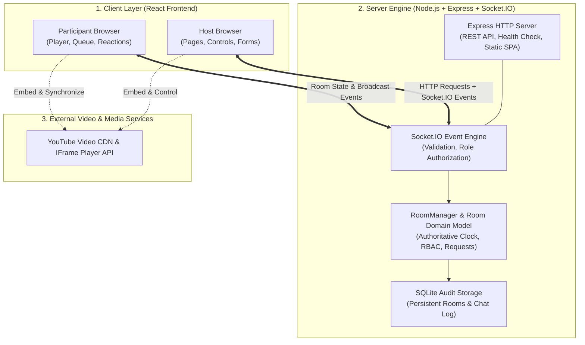

# 🏛️ Syncora — System Architecture & Data Flow

This document details the system architecture, component responsibilities, real-time event mechanisms, and data flow patterns for the **Syncora YouTube Watch Party** platform.

---

## 1. High-Level Architecture Overview

Syncora follows a **server-authoritative, multi-client real-time architecture**. The backend acts as the single source of truth for all room membership, playback states, permissions, and request approval queues. The React frontend provides a responsive, distraction-free digital screening room interface powered by the YouTube IFrame Player API and Socket.IO.

### Core 3-Tier System Diagram



---

## 2. The Real-Time Synchronization Lifecycle

As illustrated in our demonstration architecture:

```
+-----------------------------------------------------------------------------------+
|                                 React Frontend                                    |
|              Pages, forms, player, participant list, playback controls            |
+-----------------------------------------------------------------------------------+
                                        | ^
                 HTTP requests          | | Socket.IO
                 (Health, Rooms, Search)| | events
                                        v |
+-----------------------------------------------------------------------------------+
|                           Node.js + Express + Socket.IO                           |
|        Validates membership and roles, updates room state, broadcasts events      |
+-----------------------------------------------------------------------------------+
                                        | ^
                             Room state | | Socket.IO
                             broadcasts | | events
                                        v |
+-----------------------------------------------------------------------------------+
|                            Other Connected Room Members                           |
|       Receive the same video, playback state, presence and approved actions       |
+-----------------------------------------------------------------------------------+
```

### Concrete Step-by-Step Flow: When the Host Clicks Pause

1. **User Action**: The Host clicks the custom **Pause** button on the screening stage in [`PlaybackControls.tsx`](file:///Users/aryanpatel/CODE/project/watchparty/client/src/components/player/PlaybackControls.tsx).
2. **Client Emission**: [`WatchPartyContext.tsx`](file:///Users/aryanpatel/CODE/project/watchparty/client/src/context/WatchPartyContext.tsx) emits a `pause` event to the server via Socket.IO:
   ```json
   { "time": 42.5 }
   ```
3. **Backend Validation**:
   - The server handler in [`socketHandler.ts`](file:///Users/aryanpatel/CODE/project/watchparty/server/src/sockets/socketHandler.ts) resolves the client's socket session.
   - It checks room membership and verifies permissions through [`PermissionService.ts`](file:///Users/aryanpatel/CODE/project/watchparty/server/src/services/PermissionService.ts) (`canControlPlayback(participant.role)`).
   - If a regular Participant attempts to emit `pause`, the server immediately rejects the command and emits an `error_message`.
4. **State Mutation**: The server updates the authoritative room model in [`Room.ts`](file:///Users/aryanpatel/CODE/project/watchparty/server/src/models/Room.ts):
   ```typescript
   room.updatePlayState('paused', 42.5);
   ```
5. **Broadcasting**: The server broadcasts `sync_state` to all sockets in the room channel `room_${roomId}`:
   ```json
   {
     "videoId": "aqz-KE-bpKQ",
     "playState": "paused",
     "currentTime": 42.5,
     "lastUpdatedAt": 1728475200000,
     "playbackRate": 1,
     "updatedBy": "Alice"
   }
   ```
6. **Client Reconciliation & Anti-Echo Guard**:
   - All connected clients (Host and Participants) receive `sync_state`.
   - In [`YouTubePlayer.tsx`](file:///Users/aryanpatel/CODE/project/watchparty/client/src/components/player/YouTubePlayer.tsx), an internal programmatic flag (`isApplyingServerUpdate = true`) is set before calling `player.pauseVideo()`.
   - This prevents the player's native `onStateChange` listener from triggering an echo event back to the server, eliminating feedback loops.

---

## 3. Subsystem Breakdown & Responsibilities

### Frontend Layer (`client/src/`)

| File / Component | Architectural Responsibility |
| :--- | :--- |
| [`App.tsx`](file:///Users/aryanpatel/CODE/project/watchparty/client/src/App.tsx) | Application entry point and router orchestrator. Mounts layout containers and global notification toasts. |
| [`context/WatchPartyContext.tsx`](file:///Users/aryanpatel/CODE/project/watchparty/client/src/context/WatchPartyContext.tsx) | Single-source state provider. Manages Socket.IO lifecycle, handles subscriptions, and provides helper actions (`playVideo`, `pauseVideo`, `seekVideo`, `sendLike`, `requestControl`). |
| [`services/socket.ts`](file:///Users/aryanpatel/CODE/project/watchparty/client/src/services/socket.ts) | Shared Socket.IO client singleton with automatic reconnection, heartbeat pings, and environment-configured backend URLs. |
| [`components/player/YouTubePlayer.tsx`](file:///Users/aryanpatel/CODE/project/watchparty/client/src/components/player/YouTubePlayer.tsx) | Direct YouTube IFrame Player API integration. Handles asynchronous script loading, player initialization, drift detection, and anti-echo locks. |
| [`components/player/PlaybackControls.tsx`](file:///Users/aryanpatel/CODE/project/watchparty/client/src/components/player/PlaybackControls.tsx) | Scrubber timeline, play/pause toggle, jump $\pm 10\text{s}$, volume deck, control request trigger, and like button. |
| [`components/player/LikeButton.tsx`](file:///Users/aryanpatel/CODE/project/watchparty/client/src/components/player/LikeButton.tsx) | Live room like button with pulse animation, client cooldown, and tabular synced like counter. |
| [`components/player/FloatingReaction.tsx`](file:///Users/aryanpatel/CODE/project/watchparty/client/src/components/player/FloatingReaction.tsx) | Animated floating reactions rendered over the cinema player with reduced-motion support. |
| [`components/room/AudiencePresence.tsx`](file:///Users/aryanpatel/CODE/project/watchparty/client/src/components/room/AudiencePresence.tsx) | Live viewer indicator (`Watching now · X`), avatar cluster, online dots, and accessible roster popover. |
| [`components/room/ApprovalQueue.tsx`](file:///Users/aryanpatel/CODE/project/watchparty/client/src/components/room/ApprovalQueue.tsx) | Queue interface for Host/Moderator to review and approve/reject participant playback requests. |
| [`components/chat/ChatSection.tsx`](file:///Users/aryanpatel/CODE/project/watchparty/client/src/components/chat/ChatSection.tsx) | Real-time room discussion panel with server-validated identities, anti-spam rate limiting, and quick-reactions. |

### Backend Layer (`server/src/`)

| File / Component | Architectural Responsibility |
| :--- | :--- |
| [`server.ts`](file:///Users/aryanpatel/CODE/project/watchparty/server/src/server.ts) | Express HTTP server setup, CORS policy configuration, Socket.IO binding, and SPA fallback routing. |
| [`sockets/socketHandler.ts`](file:///Users/aryanpatel/CODE/project/watchparty/server/src/sockets/socketHandler.ts) | Central WebSocket event dispatcher. Validates payloads, validates room membership, enforces permissions, and manages disconnects. |
| [`services/RoomManager.ts`](file:///Users/aryanpatel/CODE/project/watchparty/server/src/services/RoomManager.ts) | In-memory room manager singleton. Creates rooms, looks up participants, handles Host succession on disconnect, and deallocates empty rooms. |
| [`models/Room.ts`](file:///Users/aryanpatel/CODE/project/watchparty/server/src/models/Room.ts) | Aggregate root domain entity for a screening room. Holds active participants, authoritative playback state, like count, request queue, and chat history. |
| [`services/PermissionService.ts`](file:///Users/aryanpatel/CODE/project/watchparty/server/src/services/PermissionService.ts) | Pure authorization rules engine. Enforces permissions for playback, role modification, and member kicking. |
| [`services/ChatRateLimiter.ts`](file:///Users/aryanpatel/CODE/project/watchparty/server/src/services/ChatRateLimiter.ts) | Sliding-window anti-spam rate limiter for room chat. |
| [`database/db.ts`](file:///Users/aryanpatel/CODE/project/watchparty/server/src/database/db.ts) | SQLite database layer providing optional persistent audit logging of created rooms and messages. |

---

## 4. Authoritative Role-Based Access Control (RBAC)

The platform enforces three distinct user roles:

```
              ┌───────────────┐
              │    👑 HOST    │  Level 3 (Room Creator / Promoted)
              └───────┬───────┘
                      │ Full Room Management & Playback
                      ▼
              ┌───────────────┐
              │  🛡️ MODERATOR │  Level 2 (Promoted by Host)
              └───────┬───────┘
                      │ Playback Control & Request Approval
                      ▼
              ┌───────────────┐
              │ 👤 PARTICIPANT│  Level 1 (Default for Joiners)
              └───────────────┘
                      │ View-Only + Submit Requests
```

### Permission Matrix

| Capability | Host | Moderator | Participant |
| :--- | :---: | :---: | :---: |
| Play, Pause, Seek | ✅ Allowed | ✅ Allowed | ❌ Rejected (Triggers Request Flow) |
| Change Active Video | ✅ Allowed | ✅ Allowed | ❌ Rejected (Triggers Request Flow) |
| Assign Roles (`assign_role`) | ✅ Allowed | ❌ Denied | ❌ Denied |
| Remove Member (`remove_participant`) | ✅ Allowed | ❌ Denied | ❌ Denied |
| Transfer Host (`transfer_host`) | ✅ Allowed | ❌ Denied | ❌ Denied |
| Review Requests (`approve_request`, `reject_request`) | ✅ Allowed | ✅ Allowed | ❌ Denied |
| Submit Playback Request (`request_playback_change`) | N/A | N/A | ✅ Allowed |
| Send Chat Messages & Reactions | ✅ Allowed | ✅ Allowed | ✅ Allowed |

---

## 5. Drift Detection & Authoritative Time Interpolation

Because video keeps playing while time passes, broadcasting static timestamps on every tick would create excessive network traffic. Instead, the server uses **mathematical interpolation**:

$$\text{Current Position}(t) = \text{currentTime} + \left(\frac{t - \text{lastUpdatedAt}}{1000}\right) \times \text{playbackRate}$$

When a client pings or synchronizes:
1. If the client’s local player is within **$1.75\text{s}$** of the calculated server time, playback continues uninterrupted without jarring micro-seeks.
2. If drift exceeds **$1.75\text{s}$** (e.g. background tab throttling or packet latency), the client performs a smooth target seek to resynchronize.
