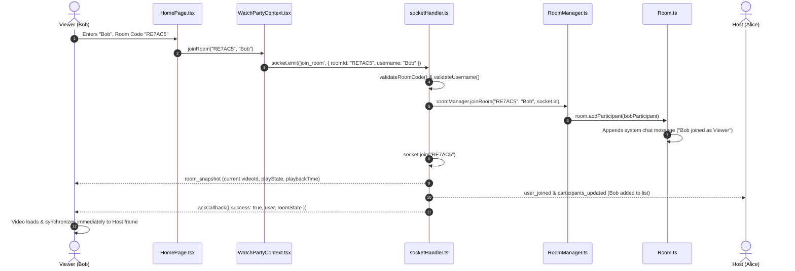
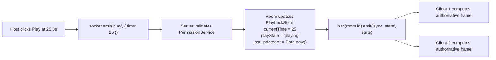
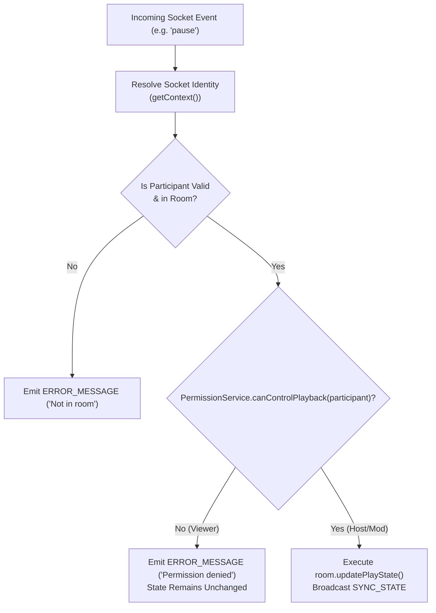
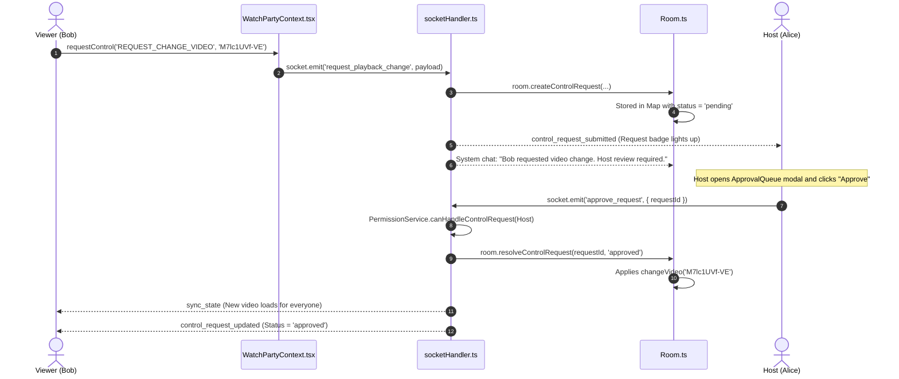
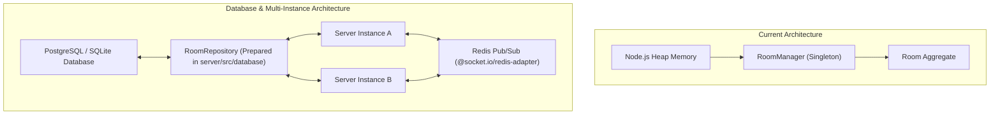

# 📘 Syncora — Comprehensive Code Walkthrough & Defense Guide

> **Audience**: Technical evaluators, interviewers, and senior engineers reviewing the **YouTube Watch Party** project.  
> **Purpose**: This document provides an in-depth, beginner-friendly walkthrough of the system architecture, component lifecycles, and real-time synchronization flows. It connects high-level concepts directly to specific files, classes, and functions in the codebase.

---

## 📑 Table of Contents

1. [How Creating a Room Works (Button Click to Backend)](#1-how-creating-a-room-works-button-click-to-backend)
2. [How a New Participant Joins Using a Room Code](#2-how-a-new-participant-joins-using-a-room-code)
3. [How Socket.IO Delivers State Changes to Other Users](#3-how-socketio-delivers-state-changes-to-other-users)
4. [How the YouTube Player Responds to Server Updates](#4-how-the-youtube-player-responds-to-server-updates)
5. [How Backend Role Checks Prevent Unauthorized Actions](#5-how-backend-role-checks-prevent-unauthorized-actions)
6. [How Playback Approval Requests Are Stored and Processed](#6-how-playback-approval-requests-are-stored-and-processed)
7. [How the Production Frontend Locates the Backend](#7-how-the-production-frontend-locates-the-backend)
8. [What is Stored in Memory vs. Persistent Database Migration](#8-what-is-stored-in-memory-vs-persistent-database-migration)
9. [Interview Defense Cheat Sheet & Key Trade-Offs](#9-interview-defense-cheat-sheet--key-trade-offs)

---

## 1. How Creating a Room Works (Button Click to Backend)

### Flow Overview
When a user visits the homepage, enters their display name, selects a starter reel (or enters a custom YouTube URL), and clicks **"Launch Screening Room"**, a sequence of client validation, socket handshake, and backend aggregate initialization occurs.

```mermaid
sequenceDiagram
    autonumber
    actor User as User (Alice)
    participant Home as HomePage.tsx
    participant Context as WatchPartyContext.tsx
    participant Socket as socket.ts (Client)
    participant Server as socketHandler.ts
    participant Manager as RoomManager.ts
    participant Room as Room.ts

    User->>Home: Enters "Alice", clicks "Launch Screening Room"
    Home->>Home: Validates username length (2-30 chars) & resolves videoId
    Home->>Context: createRoom("Alice", "aqz-KE-bpKQ")
    Context->>Socket: socket.emit('create_room', payload, ackCallback)
    Socket->>Server: Receives 'create_room' event
    Server->>Server: validateUsername() & validateVideoId()
    Server->>Manager: roomManager.createRoom("Alice", socket.id, "aqz-KE-bpKQ")
    Manager->>Manager: Generates 6-char room code (e.g. "RE7AC5")
    Manager->>Room: new Room(id, videoId) & adds Host Participant
    Manager->>Server: Returns { room, host }
    Server->>Server: socket.join(room.id)
    Server-->>Socket: Emits room_snapshot, sync_state, participants_updated
    Server-->>Context: ackCallback({ success: true, roomId, user, roomState })
    Context->>Context: Sets roomId, currentUser, updates URL to /room/RE7AC5
    Context-->>Home: Resolves promise; UI renders WatchRoomPage
```

### Relevant Code & Functions
1. **Frontend Form Submission**:
   - **File**: [`client/src/pages/Home/HomePage.tsx`](file:///Users/aryanpatel/CODE/project/watchparty/client/src/pages/Home/HomePage.tsx)
   - **Function**: `handleCreate(e: React.FormEvent)`
   - Sanitizes `username.trim()`, validates length constraints ($2 \le \text{len} \le 30$), and extracts the video ID from custom URLs via `extractYouTubeVideoId(customUrl)` ([`client/src/utils/youtube.ts`](file:///Users/aryanpatel/CODE/project/watchparty/client/src/utils/youtube.ts)).
   - Invokes `await createRoom(finalName, finalVideoId)`.
2. **Context Layer & Socket Emission**:
   - **File**: [`client/src/context/WatchPartyContext.tsx`](file:///Users/aryanpatel/CODE/project/watchparty/client/src/context/WatchPartyContext.tsx)
   - **Function**: `createRoom(username, initialVideoId)`
   - Ensures `socket.connected` is active (calling `socket.connect()` if disconnected).
   - Emits `SOCKET_EVENTS.CREATE_ROOM` (`'create_room'`) with `{ username, initialVideoId }` and a callback acknowledgment wrapper with an 8-second safety timeout.
3. **Backend Event Listener & Input Validation**:
   - **File**: [`server/src/sockets/socketHandler.ts`](file:///Users/aryanpatel/CODE/project/watchparty/server/src/sockets/socketHandler.ts)
   - **Event**: `socket.on(SOCKET_EVENTS.CREATE_ROOM, ...)`
   - Enforces strict input validation through `validateUsername` and `validateVideoId` ([`server/src/validation.ts`](file:///Users/aryanpatel/CODE/project/watchparty/server/src/validation.ts)).
   - Cleans up any prior room association using `roomManager.leaveRoom(socket.id)`.
4. **Room Lifecycle & Entity Creation**:
   - **File**: [`server/src/services/RoomManager.ts`](file:///Users/aryanpatel/CODE/project/watchparty/server/src/services/RoomManager.ts)
   - **Function**: `createRoom(hostUsername, hostSocketId, initialVideoId)`
   - Generates a unique, collision-free, human-readable 6-character room code using `generateRoomCode()` (e.g. `RE7AC5`).
   - Instantiates domain aggregate `new Room(roomId, initialVideoId)` ([`server/src/models/Room.ts`](file:///Users/aryanpatel/CODE/project/watchparty/server/src/models/Room.ts)).
   - Instantiates the Host: `new Participant(userId, hostUsername, hostSocketId, 'HOST', true)`.
   - Maps the socket ID in lookup registries: `socketToRoomId` and `socketToParticipantId`.
5. **Subscription & Response**:
   - The backend attaches the socket to the Socket.IO room channel: `socket.join(room.id)`.
   - Sends authoritative initial state: `room_snapshot`, `sync_state`, `participants_updated`.
   - Resolves the client's acknowledgment callback `{ success: true, roomId, user, roomState }`.
   - In React, the URL is updated smoothly without a page reload: `window.history.pushState({}, '', `/room/${roomId}`)`, causing [`client/src/App.tsx`](file:///Users/aryanpatel/CODE/project/watchparty/client/src/App.tsx) to mount [`WatchRoomPage.tsx`](file:///Users/aryanpatel/CODE/project/watchparty/client/src/pages/Room/WatchRoomPage.tsx).

---

## 2. How a New Participant Joins Using a Room Code

### Flow Overview
A friend receives an invite link (e.g. `https://syncora.vercel.app/room/RE7AC5`) or enters the room code manually on the home screen.



### Relevant Code & Functions
1. **Invite Route Parsing**:
   - **File**: [`client/src/App.tsx`](file:///Users/aryanpatel/CODE/project/watchparty/client/src/App.tsx)
   - When a user lands on `/room/RE7AC5` or `?room=RE7AC5`, the `useEffect` hook extracts the room parameter and pre-populates `initialRoomCode`.
2. **Join Request Trigger**:
   - **File**: [`client/src/pages/Home/HomePage.tsx`](file:///Users/aryanpatel/CODE/project/watchparty/client/src/pages/Home/HomePage.tsx)
   - **Function**: `handleJoin(e: React.FormEvent)`
   - Validates display name and room code format (alphanumeric uppercase, 4-12 characters).
   - Calls `joinRoom(finalCode, finalName)`.
3. **Backend Validation & Association**:
   - **File**: [`server/src/sockets/socketHandler.ts`](file:///Users/aryanpatel/CODE/project/watchparty/server/src/sockets/socketHandler.ts)
   - **Event**: `socket.on(SOCKET_EVENTS.JOIN_ROOM, ...)`
   - Resolves room via `roomManager.getRoom(cleanCode)`.
   - **Guaranteed Rejection**: If the room does not exist, the server immediately returns `{ success: false, error: 'Room XXX does not exist or has expired.' }` and emits `room_error`.
4. **Participant Entity Creation**:
   - **File**: [`server/src/services/RoomManager.ts`](file:///Users/aryanpatel/CODE/project/watchparty/server/src/services/RoomManager.ts) and [`server/src/models/Room.ts`](file:///Users/aryanpatel/CODE/project/watchparty/server/src/models/Room.ts)
   - Instantiates participant with role `PARTICIPANT` (`isHost: false`).
   - Appends participant to `room.participants` map.
   - Creates a server-authored system chat event announcement: `"Bob joined the room as Viewer."`.
5. **Immediate Snapshot Delivery**:
   - The backend attaches the new socket to the room channel.
   - Emits full room snapshot to the new joiner so they immediately have the current video ID, elapsed playback time, and active participant roster.
   - Emits `user_joined`, `participants_updated`, and `chat_message` to all other room members.

---

## 3. How Socket.IO Delivers State Changes to Other Users

### Flow Overview
Syncora avoids naive "spam streaming" (sending timestamps every 100ms), which wastes bandwidth and causes micro-stuttering. Instead, it implements a **Server-Authoritative Clock Model**.



### The Authoritative Mathematical Clock
- **File**: [`server/src/models/Room.ts`](file:///Users/aryanpatel/CODE/project/watchparty/server/src/models/Room.ts)
- **Functions**: `updatePlayState()` and `getAuthoritativeCurrentTime()`

The server stores only 4 key playback parameters:
1. `currentTime`: Anchor position in seconds.
2. `playState`: `'playing'` | `'paused'` | `'buffering'`.
3. `lastUpdatedAt`: Unix timestamp in milliseconds (`Date.now()`).
4. `playbackRate`: Speed multiplier (default `1.0`).

When calculating the true current position:
$$\text{Authoritative Time} = \begin{cases} \text{currentTime} + \dfrac{\text{Date.now()} - \text{lastUpdatedAt}}{1000} \times \text{playbackRate} & \text{if } \text{playState} = \text{'playing'} \\ \text{currentTime} & \text{if } \text{playState} = \text{'paused'} \end{cases}$$

### Room-Scoped Broadcasts
- **File**: [`server/src/sockets/socketHandler.ts`](file:///Users/aryanpatel/CODE/project/watchparty/server/src/sockets/socketHandler.ts)
- State changes are broadcast strictly to members of the specific room:
  ```ts
  io.to(room.id).emit(SOCKET_EVENTS.SYNC_STATE, room.getPlaybackState());
  ```
- Sockets in other rooms receive zero packets.

---

## 4. How the YouTube Player Responds to Server Updates

### Flow Overview
The YouTube IFrame Player is managed by [`client/src/components/player/YouTubePlayer.tsx`](file:///Users/aryanpatel/CODE/project/watchparty/client/src/components/player/YouTubePlayer.tsx). It must solve two difficult challenges in real-time video sync:
1. **The Anti-Echo Feedback Loop**.
2. **Network Jitter & Micro-Stuttering**.

### 1. Solving the Anti-Echo Feedback Loop
- **The Problem**:
  - When the server broadcasts a `pause` state, the client executes `player.pauseVideo()`.
  - When the YouTube IFrame pauses, it fires its native `onStateChange` event (`YT.PlayerState.PAUSED = 2`).
  - If the client's `onStateChange` handler blindly emitted a `pause` socket event back to the server, the server would re-broadcast it, creating an **infinite ping-pong feedback loop**!
- **The Solution (`isProgrammaticUpdate`)**:
  - A mutable React ref `const isProgrammaticUpdate = useRef<boolean>(false);` guards the player.
  - Before applying any incoming server state (`seekTo`, `playVideo`, `pauseVideo`, `loadVideoById`), the component sets `isProgrammaticUpdate.current = true`.
  - In `handlePlayerStateChange(state)`:
    ```tsx
    if (isProgrammaticUpdate.current) return; // Ignore echo!
    ```
  - After a short debounce window (500–800ms) allowing the YouTube IFrame to settle, `isProgrammaticUpdate.current` is reset to `false`.

### 2. Solving Micro-Stuttering with Drift Thresholding
- **The Problem**: Minor network fluctuations of 50–200ms are normal. If the player forced a `seekTo()` on every tiny difference, the audio and video would constantly stutter.
- **The Solution**:
  - In `YouTubePlayer.tsx`, the component checks:
    ```tsx
    const authoritativeTime = getAuthoritativeTime();
    const playerTime = player.getCurrentTime() || 0;
    const diff = Math.abs(playerTime - authoritativeTime);

    // Only force a seek if drift exceeds the 1.6-second tolerance threshold
    if (diff > 1.6) {
      player.seekTo(authoritativeTime, true);
    }
    ```
  - Within 1.6 seconds, video continues playing naturally. If a participant tab was backgrounded or lagged, it smoothly catches up.

### 3. Autoplay & Browser Gesture Policies
- Modern browsers (Chrome, Safari, Firefox) prohibit unmuted media from starting playback automatically without a prior user gesture.
- When `player.playVideo()` is called on join, the browser may reject the promise.
- `YouTubePlayer.tsx` catches this rejection (`playPromise.catch(...)`) and displays a non-intrusive **"Click to Unmute / Resume"** banner. Clicking it fulfills the browser's user-gesture requirement and starts synchronized audio seamlessly.

---

## 5. How Backend Role Checks Prevent Unauthorized Actions

### Architecture: Server-Authoritative RBAC
The user interface hides or alters controls for viewers, but **client-side UI is never trusted for security**. Every incoming socket action passes through server-side permission validation.



### Relevant Code & Functions
1. **Server-Owned Identity Resolution**:
   - **File**: [`server/src/sockets/socketHandler.ts`](file:///Users/aryanpatel/CODE/project/watchparty/server/src/sockets/socketHandler.ts)
   - Function: `getContext()`
   ```ts
   const room = roomManager.getRoomBySocketId(socket.id);
   const participant = room?.getParticipantBySocketId(socket.id);
   ```
   The client never supplies its role in the payload. The role is looked up strictly from server memory.
2. **Permission Rules Engine**:
   - **File**: [`server/src/services/PermissionService.ts`](file:///Users/aryanpatel/CODE/project/watchparty/server/src/services/PermissionService.ts)
   - Pure, deterministic static methods:
     - `canControlPlayback(participant)`: Only `HOST` or `MODERATOR`.
     - `canAssignRoles(actor)`: Strictly `HOST` only.
     - `canRemoveParticipant(actor, target)`: Strictly `HOST` only (cannot remove self or target who is already Host).
     - `canHandleControlRequest(actor)`: Only `HOST` or `MODERATOR`.
     - `canTransferHost(actor, target)`: Strictly `HOST` only.
3. **Execution Guards**:
   - If an unauthorized viewer uses developer tools or emits a manual WebSocket message (`socket.emit('play', { time: 0 })`), the server evaluates `PermissionService.canControlPlayback(participant)`.
   - The command is rejected immediately with an informative error message:
     ```json
     { "message": "Permission denied: Only Host or Moderator can play video." }
     ```
   - No state changes occur, and other participants remain unaffected.

---

## 6. How Playback Approval Requests Are Stored and Processed

### Flow Overview
When a Participant wants to change the video or take control, they submit an approval request instead of being hard-blocked.



### Relevant Code & Functions
1. **Submission**:
   - **File**: [`client/src/components/player/PlaybackControls.tsx`](file:///Users/aryanpatel/CODE/project/watchparty/client/src/components/player/PlaybackControls.tsx) and [`client/src/components/player/VideoSelectorModal.tsx`](file:///Users/aryanpatel/CODE/project/watchparty/client/src/components/player/VideoSelectorModal.tsx)
   - Viewers trigger `requestControl(...)` or `requestPlaybackChange(...)`.
2. **Backend Validation & Storage**:
   - **File**: [`server/src/sockets/socketHandler.ts`](file:///Users/aryanpatel/CODE/project/watchparty/server/src/sockets/socketHandler.ts)
   - Function: `handlePlaybackChangeRequest()`
   - Validates parameters (e.g. YouTube video ID format, seek boundaries).
   - **File**: [`server/src/models/Room.ts`](file:///Users/aryanpatel/CODE/project/watchparty/server/src/models/Room.ts)
   - Stored in an internal map: `private controlRequests: Map<string, ControlRequest> = new Map();`
   - Generates unique ID (`req_...`), records requester `userId`, `username`, requested action, and sets `status = 'pending'`.
3. **Review & Approval Execution**:
   - **File**: [`client/src/components/room/ApprovalQueue.tsx`](file:///Users/aryanpatel/CODE/project/watchparty/client/src/components/room/ApprovalQueue.tsx)
   - Host/Moderator clicks **Approve** or **Decline**.
   - Server validates reviewer permissions via `PermissionService.canHandleControlRequest(actor)`.
   - **Execution in `Room.resolveControlRequest`**:
     - If approved and action was video change: executes `this.changeVideo(...)`.
     - If approved and action was play/pause/seek: updates room playback state.
     - If approved and action was role request: executes `participant.promoteToModerator()`.
   - Broadcasts `CONTROL_REQUEST_UPDATED`, `SYNC_STATE`, `PARTICIPANTS_UPDATED`, and an automated system chat message to the room.

---

## 7. How the Production Frontend Locates the Backend

### Environment Architecture
- **File**: [`client/src/lib/socket.ts`](file:///Users/aryanpatel/CODE/project/watchparty/client/src/lib/socket.ts)
- **Function**: `getBackendUrl()`

```ts
export function getBackendUrl(): string {
  const envUrl =
    import.meta.env.VITE_SOCKET_URL ||
    import.meta.env.VITE_API_URL ||
    import.meta.env.VITE_SERVER_URL ||
    import.meta.env.VITE_BACKEND_URL;

  if (envUrl && typeof envUrl === 'string' && envUrl.trim()) {
    return envUrl.trim().replace(/\/+$/, ''); // Strip trailing slashes
  }

  if (typeof window !== 'undefined') {
    if (window.location.port === '5173' || window.location.port === '3000') {
      return 'http://localhost:4000';
    }
    return window.location.origin;
  }
  return 'http://localhost:4000';
}
```

### Local Development vs. Production (Vercel + Render)
1. **Local Development**:
   - The Vite dev server runs on `http://localhost:5173`.
   - `getBackendUrl()` detects port 5173 and defaults to `http://localhost:4000`.
2. **Production on Vercel**:
   - Vite environment variables prefixed with `VITE_` are **embedded at build time** into compiled JavaScript chunks.
   - Setting `VITE_SOCKET_URL=https://syncora-backend.onrender.com` in Vercel causes the client bundle to connect directly to the Render Web Service.
3. **HTTPS / WSS Transport Negotiation**:
   - When the client connects via `https://...`, the Socket.IO client automatically negotiates a WebSocket upgrade to `wss://` (secure WebSockets).
   - Render terminates SSL/TLS at its edge reverse proxy and forwards traffic to the Node.js process over HTTP.
   - Express enables `app.set('trust proxy', 1)` in [`server/src/server.ts`](file:///Users/aryanpatel/CODE/project/watchparty/server/src/server.ts) to respect `x-forwarded-proto` headers.
4. **Vercel SPA Client-Side Routing**:
   - Direct links like `https://syncora.vercel.app/room/RE7AC5` are handled by [`client/vercel.json`](file:///Users/aryanpatel/CODE/project/watchparty/client/vercel.json):
     ```json
     {
       "rewrites": [{ "source": "/(.*)", "destination": "/index.html" }]
     }
     ```
   - This ensures Vercel never returns a `404 Not Found` for direct room URLs; `/index.html` is served, and React parses the route in `App.tsx`.

---

## 8. What is Stored in Memory vs. Persistent Database Migration

### Current In-Memory State Architecture
All runtime state currently resides in Node.js server heap memory:
1. `RoomManager.ts`:
   - `rooms`: `Map<string, Room>` — Registry of active watch party rooms.
   - `socketToRoomId`: `Map<string, string>` — Maps connection sockets to room IDs.
   - `socketToParticipantId`: `Map<string, string>` — Maps sockets to participant IDs.
2. `Room.ts`:
   - `participants`: `Map<string, Participant>` — Active room members.
   - `playback`: `PlaybackState` — Video ID, play state, anchor time, last updated timestamp.
   - `controlRequests`: `Map<string, ControlRequest>` — Pending and handled requests.
   - `chatHistory`: `ChatMessage[]` — Rolling buffer of recent chat messages (capped at 100).

### Advantages & Trade-Offs of In-Memory State
- **Advantages**:
  - **Zero Database Latency**: Microsecond read/write performance essential for frame-accurate playback.
  - **Automatic Garbage Collection**: When the last user disconnects, the room is deleted from memory automatically, preventing stale data buildup.
- **Limitations**:
  - **Process Ephemerality**: If the server process restarts (or Render's free tier spins down), active rooms are reset.
  - **Single-Process Constraint**: Sockets connected to different server instances cannot communicate without an external message broker.

### Migration Path to a Persistent Database
The codebase is structured with Object-Oriented aggregates and service boundaries, making database integration straightforward:



1. **Prepared Codebase Foundations**:
   - Notice that [`server/src/database/db.ts`](file:///Users/aryanpatel/CODE/project/watchparty/server/src/database/db.ts) and [`server/src/database/roomRepository.ts`](file:///Users/aryanpatel/CODE/project/watchparty/server/src/database/roomRepository.ts) already exist in the project, defining tables for `rooms`, `participants`, and `messages`.
2. **Horizontal Scaling with Redis**:
   - In a multi-server setup, configure `@socket.io/redis-adapter`. When Server A emits a playback sync event, Redis Pub/Sub distributes the packet to Server B, ensuring all connected users stay synchronized across cluster nodes.

---

## 9. Interview Defense Cheat Sheet & Key Trade-Offs

| Decision | Why We Chose It | Alternative Considered | Trade-Off Made |
| :--- | :--- | :--- | :--- |
| **Custom Player Controls vs. Native YouTube Controls** | Native iframe controls allow users to click pause without the application knowing, causing instant desync. Custom controls intercept every action, validate permissions, and broadcast them. | Native `controls: 1` | Requires implementing our own scrubber, volume deck, and fullscreen handlers. |
| **Server-Authoritative Clock vs. Continuous Tick Pings** | Sending video time every 100ms wastes bandwidth and causes stutter. The server stores `(time, state, timestamp)` and clients compute elapsed time locally. | Streaming timestamps 10x/sec | Requires mathematical elapsed-time calculation on clients. |
| **1.6-Second Drift Tolerance Window** | Minor network jitter (50–300ms) is natural. Seeking on tiny variations creates audio glitches. | Zero-tolerance instant seeking | Small momentary differences are tolerated for smooth playback. |
| **Anti-Echo Ref Flag (`isProgrammaticUpdate`)** | Prevents client from broadcasting an event when simply applying a server command, avoiding infinite feedback loops. | Diffing timestamps | Ref flag is lightweight, deterministic, and instant. |
| **In-Memory Aggregate vs. Database on Every Event** | Playback events occur rapidly (scrubbing, seeking). Database I/O on every tick would create unacceptable lag. | Writing every seek to SQL | Rooms reset if server restarts; addressed via clean migration roadmap. |

---

*Authored for the Syncora YouTube Watch Party Project Evaluation.*
