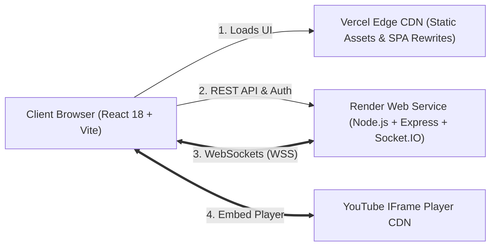

# 🚀 Production Deployment Guide — Vercel & Render

This guide provides end-to-end instructions for deploying the **Syncora YouTube Watch Party** system with the **frontend hosted on Vercel** and the **backend hosted on Render**.

## 🌐 Current Production Deployment

| Service | Platform | Live URL | Health Status |
| :--- | :--- | :--- | :--- |
| **Frontend Client** | Vercel | [https://client-lac-nu-17.vercel.app](https://client-lac-nu-17.vercel.app) | 🟢 200 OK |
| **Backend API & WebSockets** | Render | [https://syncora-backend-rfs0.onrender.com](https://syncora-backend-rfs0.onrender.com) | 🟢 200 OK (`/health`) |

---

## 1. System Architecture Overview



- **Frontend (Vercel)**: Fast globally distributed static bundle. Client-side routes (`/room/:roomId`, `/watch/:videoId`, `/library/*`) are rewritten to `index.html`.
- **Backend (Render)**: Persistent Node.js service handling REST API endpoints, real-time Socket.IO room coordination, Scrypt authentication, and SQLite persistence.
- **YouTube IFrame**: Official embedded player API runs client-side in the browser, synchronized by timestamps emitted from the Render backend.

---

## 2. Backend Deployment on Render

### Step 1: Create a Render Web Service
1. Log into your [Render Dashboard](https://dashboard.render.com/).
2. Click **New +** ➔ **Web Service**.
3. Select **Build and deploy from a Git repository** and connect your GitHub repo:
   ```
   https://github.com/AryanPatel-AI/syncora
   ```

### Step 2: Configure Service Settings
| Setting | Recommended Value | Notes |
| :--- | :--- | :--- |
| **Name** | `syncora-backend` | Will generate `https://syncora-backend.onrender.com` |
| **Region** | Oregon (US West) or closest to your users | Standard latency |
| **Branch** | `main` | Production branch |
| **Root Directory** | `server` | Important: points directly to the server project |
| **Runtime** | `Node` | LTS environment |
| **Build Command** | `npm install && npm run build` | Compiles TypeScript into `server/dist` |
| **Start Command** | `npm start` | Runs `node dist/server.js` |
| **Plan Type** | `Free` | Supports WebSockets and HTTP/2 |

### Step 3: Configure Environment Variables in Render
In the **Environment** tab, add the following variables:

| Key | Value | Purpose |
| :--- | :--- | :--- |
| `NODE_ENV` | `production` | Enables strict CORS and production optimizations |
| `FRONTEND_URL` | `https://YOUR_VERCEL_URL.vercel.app` | Allowed origin for Express and Socket.IO CORS *(Update after Step 3)* |
| `CLIENT_URL` | `https://YOUR_VERCEL_URL.vercel.app` | Fallback alias matching `FRONTEND_URL` |
| `PORT` | `10000` | Render injects `$PORT` automatically; server reads `process.env.PORT` |
| `SESSION_SECRET` | *(Random 32+ character hex string)* | Signs authentication session tokens |
| `YOUTUBE_API_KEY` | *(Optional - your YouTube v3 API key)* | Real-time live discovery; falls back to curated catalog if omitted |

4. Click **Create Web Service**.
5. Once deployment completes, note your backend URL:
   ```
   https://YOUR_RENDER_URL.onrender.com
   ```
6. Verify deployment by opening `https://YOUR_RENDER_URL.onrender.com/health` in your browser. It should return:
   ```json
   { "status": "ok", "service": "Syncora Watch Party Backend" }
   ```

---

## 3. Frontend Deployment on Vercel

> [!IMPORTANT]
> Vite embeds `import.meta.env.VITE_*` variables into the JavaScript bundle **at build time**. You must set your environment variables in Vercel before triggering the initial build.

### Step 1: Create a Vercel Project
1. Log into your [Vercel Dashboard](https://vercel.com/).
2. Click **Add New...** ➔ **Project**.
3. Import your GitHub repository (`AryanPatel-AI/syncora`).

### Step 2: Configure Project Settings
- **Framework Preset**: `Vite`
- **Root Directory**: Click *Edit* and select `client`
- **Build Command**: `npm run build` (or leave default Vite build)
- **Output Directory**: `dist` (default)
- **Install Command**: `npm install`

*(Note: If you leave Root Directory as `.`, the root `vercel.json` will automatically run `npm run build:client` and serve `client/dist`.)*

### Step 3: Configure Environment Variables in Vercel
Expand the **Environment Variables** section and add:

| Key | Value | Notes |
| :--- | :--- | :--- |
| `VITE_SERVER_URL` | `https://YOUR_RENDER_URL.onrender.com` | Base backend server URL (without trailing slash) |
| `VITE_SOCKET_URL` | `https://YOUR_RENDER_URL.onrender.com` | WebSocket host for Socket.IO |
| `VITE_API_URL` | `https://YOUR_RENDER_URL.onrender.com` | REST API host |

4. Click **Deploy**.
5. Once the build finishes, Vercel will assign your public production URL:
   ```
   https://YOUR_VERCEL_URL.vercel.app
   ```

---

## 4. Connect Frontend & Backend (CORS Linking)

Now that both URLs are known:

1. Return to your **Render Dashboard** ➔ `syncora-backend` ➔ **Environment**.
2. Update `FRONTEND_URL` and `CLIENT_URL` with your exact Vercel URL:
   ```env
   FRONTEND_URL=https://YOUR_VERCEL_URL.vercel.app
   CLIENT_URL=https://YOUR_VERCEL_URL.vercel.app
   ```
   *(If you also connect a custom domain later, separate with commas: `https://YOUR_VERCEL_URL.vercel.app,https://yourdomain.com`)*
3. Render will automatically redeploy with the updated CORS policy.

---

## 5. Verification Checklist (Two-Device / Multi-Window Test)

Perform these steps to verify full production functionality:

- [ ] **1. Public Availability**: Navigate to `https://YOUR_VERCEL_URL.vercel.app` in a desktop browser. Verify page loads cleanly with dark screening-room styling.
- [ ] **2. Single-Page Routing**: Refresh the page or navigate directly to `https://YOUR_VERCEL_URL.vercel.app/live`. Verify Vercel rewrites route to `index.html` without `404` errors.
- [ ] **3. WebSockets Connection**: Open DevTools ➔ Network ➔ WS filter. Verify Socket.IO connects via `wss://YOUR_RENDER_URL.onrender.com/socket.io/...` with HTTP status `101 Switching Protocols` (or transport polling fallback `200`).
- [ ] **4. Room Creation**: Click **Start Watch Party** as **User A**. Verify a 6-character room code is generated and you are designated **HOST**.
- [ ] **5. Join via Share Link**: Copy the invite URL (`https://YOUR_VERCEL_URL.vercel.app/room/XXXXXX`) and open it in an **Incognito Window** or second browser as **User B**.
- [ ] **6. Real-Time Roster**: Verify User A's screen updates immediately showing User B as **PARTICIPANT**.
- [ ] **7. Synchronized Playback**:
  - User A (Host) presses Play ➔ Video starts on both screens.
  - User A pauses ➔ Video pauses on both screens within sub-second precision.
  - User A scrubs timeline ➔ User B automatically follows.
- [ ] **8. Server-Enforced RBAC**:
  - On User B's screen, attempt playback control. Verify action requires approval or is rejected.
  - User B submits a control request ➔ User A receives approval badge.
  - User A approves request ➔ State synchronizes across both clients.
- [ ] **9. Real-Time Chat & Floating Reactions**: Send messages and emoji reactions; verify instant delivery without reload.
- [ ] **10. Graceful Reconnection**: Toggle Wi-Fi or refresh User B's tab; verify participant reconnects and syncs to authoritative room playback time.

---

## 6. Architecture & Limitations

1. **Render Free Tier Cold Starts**:
   - On the Render Free tier, instances spin down after 15 minutes of inactivity. The first incoming request may take 30–50 seconds to wake up. Subsequent requests run with standard low latency.
2. **Room State & Server Restarts**:
   - Active playback synchronization runs via in-memory aggregates ([`RoomManager.ts`](file:///Users/aryanpatel/CODE/project/watchparty/server/src/services/RoomManager.ts)).
   - Room queues, users, watch history, and saved videos persist in SQLite (`watchparty.db`).
   - If Render restarts a free container, active real-time connections temporarily drop; clients automatically reconnect within 5 seconds once the server restarts.
3. **Multi-Instance Clustering**:
   - Single-instance Node.js serves all active rooms natively. If scaling across multiple Render instances in the future, configure `@socket.io/redis-adapter` with a Redis Pub/Sub instance.
