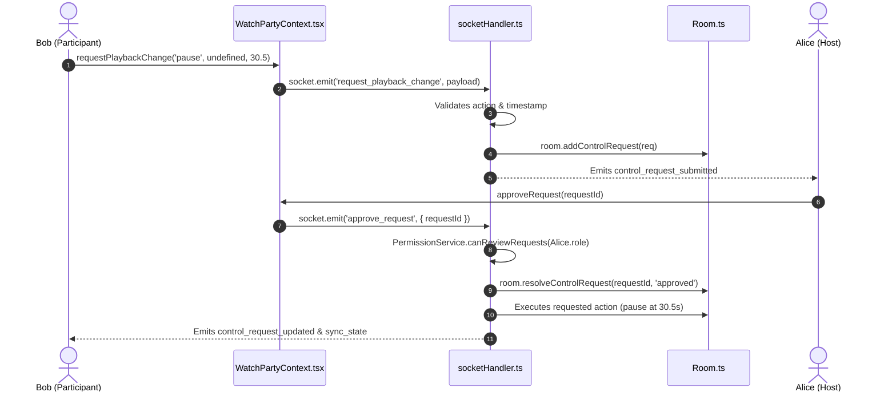

# 🔍 Syncora — Logic Walkthrough & Code Flow Reference

This document provides a line-by-line, function-by-function breakdown of the major operations in Syncora. It is designed to help engineers, interviewers, and evaluators trace every user action from the browser UI down to the server domain models and back to connected peers.

---

## 1. Room Creation Flow

### Overview
A user opens the app, enters a display name (e.g., `"Alice"`), optionally chooses or pastes a starter video, and clicks **"Launch Screening Room"**.

```mermaid
sequenceDiagram
    autonumber
    actor Alice as User (Alice)
    participant Home as HomePage.tsx
    participant Context as WatchPartyContext.tsx
    participant Socket as socket.ts
    participant Server as socketHandler.ts
    participant Manager as RoomManager.ts
    participant Room as Room.ts

    Alice->>Home: Enters "Alice", clicks "Launch Screening Room"
    Home->>Context: createRoom("Alice", "aqz-KE-bpKQ")
    Context->>Socket: socket.emit('create_room', payload, callback)
    Socket->>Server: socket.on('create_room')
    Server->>Server: validateUsername() & validateVideoId()
    Server->>Manager: roomManager.createRoom("Alice", socket.id, videoId)
    Manager->>Manager: Generates 6-char code (e.g. "LC4KJW")
    Manager->>Room: new Room(id, videoId) + addParticipant(HOST)
    Server->>Server: socket.join(room.id)
    Server-->>Socket: Emits room_snapshot, sync_state, presence_updated
    Server-->>Context: Invokes callback({ success: true, roomId, user })
    Context->>Context: Sets roomId, currentUser, updates URL to /room/LC4KJW
    Context-->>Home: Resolves promise; UI renders WatchRoomPage
```

### Detailed Code Execution

1. **Frontend Initiation**:
   - **File**: [`client/src/pages/Home/HomePage.tsx`](file:///Users/aryanpatel/CODE/project/watchparty/client/src/pages/Home/HomePage.tsx)
   - **Function**: `handleCreate(e: React.FormEvent)`
   - Strips whitespace with `username.trim()`. Validates that $2 \le \text{length} \le 30$.
   - Calls `createRoom(finalName, finalVideoId)` exposed by [`WatchPartyContext.tsx`](file:///Users/aryanpatel/CODE/project/watchparty/client/src/context/WatchPartyContext.tsx).

2. **Socket Emission & Promise Wrapper**:
   - **File**: [`client/src/context/WatchPartyContext.tsx`](file:///Users/aryanpatel/CODE/project/watchparty/client/src/context/WatchPartyContext.tsx)
   - **Function**: `createRoom(rawUsername: string, initialVideoId?: string)`
   - Emits `SOCKET_EVENTS.CREATE_ROOM` with payload `{ username, initialVideoId }` and an acknowledgement callback.

3. **Backend Receipt & Input Validation**:
   - **File**: [`server/src/sockets/socketHandler.ts`](file:///Users/aryanpatel/CODE/project/watchparty/server/src/sockets/socketHandler.ts)
   - **Handler**: `socket.on(SOCKET_EVENTS.CREATE_ROOM, ...)`
   - Runs `validateUsername(data?.username)` and `validateVideoId(data?.initialVideoId)` ([`server/src/validation.ts`](file:///Users/aryanpatel/CODE/project/watchparty/server/src/validation.ts)). If validation fails, triggers the callback with `{ success: false, error: validation.error }`.

4. **Aggregate Root Instantiation**:
   - **File**: [`server/src/services/RoomManager.ts`](file:///Users/aryanpatel/CODE/project/watchparty/server/src/services/RoomManager.ts)
   - **Function**: `createRoom(hostUsername: string, hostSocketId: string, initialVideoId?: string)`
   - Generates a cryptographically random, collision-resistant 6-character room code using `nanoid` or alphanumeric alphabet.
   - Instantiates `new Room(roomId, initialVideoId)` ([`server/src/models/Room.ts`](file:///Users/aryanpatel/CODE/project/watchparty/server/src/models/Room.ts)).
   - Creates the creator participant entity with `role = 'HOST'` and `isHost = true`.
   - Maps `socketId -> roomId` in internal memory.

5. **Socket Channel Joining & Broadcast**:
   - In [`socketHandler.ts`](file:///Users/aryanpatel/CODE/project/watchparty/server/src/sockets/socketHandler.ts), calls `socket.join(room.id)`.
   - Emits `room_snapshot` to the calling socket.
   - Emits `presence_updated` and `participants_updated` to the room.
   - Calls acknowledgement callback with `{ success: true, roomId: room.id, user, roomState }`.

---

## 2. Room Joining Flow (Code or Invite Link)

### Overview
A second user (e.g. `"Bob"`) arrives via an invite link (`/room/LC4KJW`) or enters the room code on the Home page.

```mermaid
sequenceDiagram
    autonumber
    actor Bob as User (Bob)
    participant Home as HomePage.tsx
    participant Context as WatchPartyContext.tsx
    participant Socket as socket.ts
    participant Server as socketHandler.ts
    participant Manager as RoomManager.ts
    participant Alice as Alice (Host)

    Bob->>Home: Enters "Bob" + Code "LC4KJW", clicks Join
    Home->>Context: joinRoom("Bob", "LC4KJW")
    Context->>Socket: socket.emit('join_room', payload, callback)
    Socket->>Server: socket.on('join_room')
    Server->>Server: validateUsername() & validateRoomId()
    Server->>Manager: roomManager.joinRoom("LC4KJW", "Bob", socket.id)
    Manager->>Manager: Creates Participant(role='PARTICIPANT')
    Server->>Server: socket.join("LC4KJW")
    Server-->>Socket: Callback({ success: true, roomState, user })
    Server-->>Alice: Emits user_joined, presence_updated
    Context->>Context: Populates room snapshot; transitions to WatchRoomPage
```

### Detailed Code Execution

1. **URL Parameter Extraction**:
   - **File**: [`client/src/App.tsx`](file:///Users/aryanpatel/CODE/project/watchparty/client/src/App.tsx)
   - Checks `window.location.search` for `?room=...` and pathname `/room/:roomId`. Pre-populates the join form.

2. **Joining Backend Execution**:
   - **File**: [`server/src/services/RoomManager.ts`](file:///Users/aryanpatel/CODE/project/watchparty/server/src/services/RoomManager.ts)
   - **Function**: `joinRoom(roomId: string, username: string, socketId: string)`
   - Looks up room in `this.rooms.get(roomId)`. If missing, returns `{ error: 'Room does not exist' }`.
   - Adds Bob as a `PARTICIPANT`.
   - Generates authoritative `room.getStateSnapshot()` containing `playback`, `participants`, `likeCount`, and `pendingRequests`.

3. **Room-Wide Presence Broadcast**:
   - The server calls `emitPresenceUpdated(room)` in [`socketHandler.ts`](file:///Users/aryanpatel/CODE/project/watchparty/server/src/sockets/socketHandler.ts):
     - Broadcasts `user_joined` to everyone in the room.
     - Broadcasts `presence_updated` (`{ count: 2, participants }`).
     - Alice’s UI automatically reflects `Watching now · 2` with Bob’s avatar.

---

## 3. Playback Synchronization & Anti-Echo Loop Handling

### Overview
Preventing **feedback loops** (infinite echo cycles) is one of the most critical engineering challenges in shared video players:

$$\text{Remote Pause Received} \xrightarrow{\text{calls player.pauseVideo()}} \text{Player fires onStateChange(2)} \xrightarrow{\text{MUST NOT emit pause back to server!}}$$

### Detailed Code Execution

1. **Controller Emits Action**:
   - **File**: [`client/src/components/player/PlaybackControls.tsx`](file:///Users/aryanpatel/CODE/project/watchparty/client/src/components/player/PlaybackControls.tsx)
   - Host clicks Play, Pause, or drags scrubber.
   - Invokes `playVideo(time)`, `pauseVideo(time)`, or `seekVideo(time)` in [`WatchPartyContext.tsx`](file:///Users/aryanpatel/CODE/project/watchparty/client/src/context/WatchPartyContext.tsx).

2. **Server Validates Permission & Updates Clock**:
   - **File**: [`server/src/sockets/socketHandler.ts`](file:///Users/aryanpatel/CODE/project/watchparty/server/src/sockets/socketHandler.ts)
   - Verifies `PermissionService.canControlPlayback(participant.role)`.
   - In [`Room.ts`](file:///Users/aryanpatel/CODE/project/watchparty/server/src/models/Room.ts):
     ```typescript
     this.playback = {
       ...this.playback,
       playState: 'paused',
       currentTime: validatedTime,
       lastUpdatedAt: Date.now(),
       updatedBy: participant.username,
     };
     ```
   - Emits `sync_state` to all room sockets.

3. **Anti-Echo Guard in YouTube Player**:
   - **File**: [`client/src/components/player/YouTubePlayer.tsx`](file:///Users/aryanpatel/CODE/project/watchparty/client/src/components/player/YouTubePlayer.tsx)
   - **Refs**:
     - `isApplyingServerUpdate = useRef<boolean>(false)`
     - `lastAppliedState = useRef<string>('')`
   - When incoming `playback` prop changes:
     ```typescript
     isApplyingServerUpdate.current = true;
     if (playback.playState === 'playing') {
       player.playVideo();
     } else if (playback.playState === 'paused') {
       player.pauseVideo();
     }
     setTimeout(() => {
       isApplyingServerUpdate.current = false;
     }, 400);
     ```
   - Inside the player’s native event listener `handlePlayerStateChange(event)`:
     ```typescript
     if (isApplyingServerUpdate.current) {
       // Suppress echo! Do not notify server!
       return;
     }
     ```

4. **Drift Detection & Correction**:
   - Inside `setInterval` polling:
     ```typescript
     const drift = Math.abs(localCurrentTime - expectedServerTime);
     if (drift > 1.75) {
       player.seekTo(expectedServerTime, true);
     }
     ```

---

## 4. Role Authorization & RBAC Enforcement

### Overview
Authorization is strictly server-enforced in [`PermissionService.ts`](file:///Users/aryanpatel/CODE/project/watchparty/server/src/services/PermissionService.ts).

### Detailed Code Execution

1. **Unauthorized Command Attempt**:
   - Bob (Participant) opens browser console and runs:
     ```javascript
     socket.emit('pause', { time: 10 });
     ```
2. **Server Enforcement**:
   - In [`socketHandler.ts`](file:///Users/aryanpatel/CODE/project/watchparty/server/src/sockets/socketHandler.ts):
     ```typescript
     if (!PermissionService.canControlPlayback(participant.role)) {
       emitError('Permission denied: Only Host or Moderator can pause video.');
       return;
     }
     ```
   - Command is stopped immediately before touching `room` state.
   - An `error_message` packet is sent only to Bob's socket.
   - Alice’s playback is completely unaffected.

---

## 5. Playback Approval Request Workflow

### Overview
Participants cannot modify playback directly, but they can request changes from the Host and Moderator.



### Detailed Code Execution

1. **Submission**:
   - **File**: [`client/src/components/player/PlaybackControls.tsx`](file:///Users/aryanpatel/CODE/project/watchparty/client/src/components/player/PlaybackControls.tsx)
   - When a Participant clicks Play/Pause or the Scrubber, `handleRequestControl()` is invoked.
   - Calls `requestPlaybackChange(action, videoId, time)`.

2. **Server Queue Management**:
   - **File**: [`server/src/models/Room.ts`](file:///Users/aryanpatel/CODE/project/watchparty/server/src/models/Room.ts)
   - **Function**: `addControlRequest(request)`
   - Creates a unique request entity:
     ```typescript
     {
       id: `req_${Date.now()}_${nanoid(7)}`,
       userId: participant.id,
       username: participant.username,
       type: 'seek',
       status: 'pending',
       requestedTime: 30.5,
       createdAt: Date.now()
     }
     ```
   - Emits `control_request_submitted` to the room.

3. **Approval Execution**:
   - **File**: [`server/src/sockets/socketHandler.ts`](file:///Users/aryanpatel/CODE/project/watchparty/server/src/sockets/socketHandler.ts)
   - **Function**: `handleResolveRequest(socket, requestId, 'approved')`
   - Verifies `PermissionService.canReviewRequests(reviewer.role)`.
   - Dispatches the requested action onto the room model (`room.updatePlayState(...)` or `room.seek(...)` or `room.changeVideo(...)`).
   - Broadcasts both `control_request_updated` and the resulting `sync_state`.

---

## 6. Disconnect, Host Succession, and Room Deallocation

### Overview
When a Host disconnects or reloads their page, the room must not break or leave participants stranded without a leader.

### Detailed Code Execution

1. **Disconnect Event**:
   - **File**: [`server/src/sockets/socketHandler.ts`](file:///Users/aryanpatel/CODE/project/watchparty/server/src/sockets/socketHandler.ts)
   - Socket triggers `'disconnect'`. Calls `roomManager.leaveRoom(socket.id)`.

2. **Succession Logic**:
   - **File**: [`server/src/services/RoomManager.ts`](file:///Users/aryanpatel/CODE/project/watchparty/server/src/services/RoomManager.ts)
   - If the departing member is `HOST` and other participants remain:
     - **Rule 1 (Moderator First)**: Searches for the first participant with `role === 'MODERATOR'` and promotes them to `HOST`.
     - **Rule 2 (Seniority Fallback)**: If no moderators exist, selects the participant with the earliest `joinedAt` timestamp and promotes them to `HOST`.
   - Returns `{ room, participant, roomDeleted, previousHostId, newHostId }`.

3. **Room Broadcast**:
   - Emits `host_transferred` (`{ previousHostId, newHostId, participants }`).
   - Appends a system chat message: `"Host left. Bob is now the room Host."`
   - Emits `presence_updated` with updated counts.

4. **Empty Room Deletion**:
   - If the last participant leaves (`room.getParticipantCount() === 0`):
     - `this.rooms.delete(room.id)` is called.
     - In-memory data structures are freed, preventing memory leaks.
